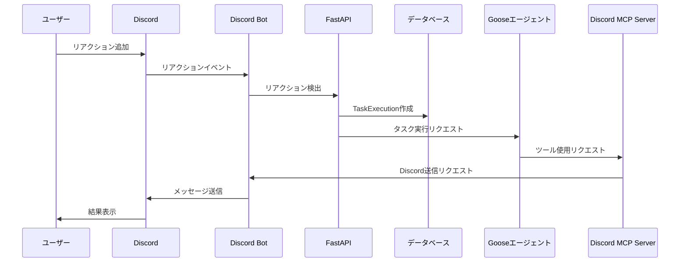

# Discord MCPサーバー実装計画

## 現状分析

現在のDiscord連携の流れは以下のようになっています：

1. ユーザーがDiscordでリアクションを付ける
2. Discord Botがリアクションを検出
3. FastAPIプロセスがGooseエージェントにタスクを実行させる
4. 結果をFastAPIプロセスがDiscord Botを通じてチャンネルに返送

この流れを以下のように変更します：

1. ユーザーがDiscordでリアクションを付ける
2. Discord Botがリアクションを検出
3. FastAPIプロセスはTaskExecutionモデルにログとして保存するのみ
4. GooseエージェントがMCPを経由してDiscord Botに結果を送信

## 実装計画

### 1. Discord MCP サーバーの作成



### 2. 実装ステップ

#### 2.1 Discord MCP サーバーの実装

1. `api/mcp/discord_server.py` を作成し、MCPサーバーを実装
   - SSEトランスポートを使用
   - ツール定義：`discord_send_message`

#### 2.2 FastAPIエンドポイントの実装

1. `api/routes/mcp.py` を作成し、SSEエンドポイントを実装

#### 2.3 Discord Serviceの拡張

1. `api/services/discord_service.py` を拡張し、メッセージ送信機能を追加

#### 2.4 FastAPI main.pyの更新

1. `api/main.py` を更新し、MCPルーターを追加

#### 2.5 TaskExecutionモデルの更新

1. `api/models/task_execution.py` を更新し、MCPレスポンスフィールドを追加

#### 2.6 TaskServiceの更新

1. `api/services/task_service.py` を更新し、MCPレスポンス関連の処理を追加

#### 2.7 Discord Botの更新

1. `extensions/discord/bot.py` を更新し、FastAPIプロセスからの直接送信を削除

### 3. Goose拡張機能の設定

Dockerfileの「Goose CLIの設定」部分を以下のように修正し、Discord MCPサーバーの設定を追加します：

```dockerfile
# Goose CLIの設定
RUN mkdir -p /home/goosuke/.config/goose
RUN cat <<EOF > /home/goosuke/.config/goose/config.yaml
GOOSE_PROVIDER: ${GOOSE_PROVIDER}
GOOSE_MODEL: ${GOOSE_MODEL}
keyring: false
extensions:
  discord_mcp:
    type: "sse"
    url: "http://localhost:8000/mcp/discord/sse"
    timeout: 30
EOF
```

### 4. マイグレーションの作成

1. TaskExecutionモデルの変更に対応するマイグレーションを作成

### 5. テストの実装

1. Discord MCPサーバーのテストを実装
2. SSEエンドポイントのテストを実装
3. TaskExecutionモデルの変更のテストを実装

## 実装の利点

1. **責任の分離**: FastAPIプロセスはデータ保存のみを担当し、Gooseエージェントが結果の送信を担当
2. **柔軟性の向上**: Gooseエージェントは必要に応じて複数回のメッセージ送信や追加情報の取得が可能
3. **拡張性**: 将来的に他のMCPサーバーを追加することで、Gooseエージェントの機能を拡張可能
4. **標準化**: MCPプロトコルを使用することで、AIモデルと外部ツール間の通信が標準化される

## 実装スケジュール

1. Discord MCPサーバーの実装: 2日
2. FastAPIエンドポイントの実装: 1日
3. モデルとサービスの更新: 1日
4. テストの実装: 2日
5. 統合テストとデバッグ: 1日

合計: 約1週間

## 次のステップ

1. 実装完了後、他のMCPサーバー（例：Slack、メール送信など）の追加を検討
2. Gooseエージェントが使用できるMCPツールのライブラリを拡充
3. MCPサーバーの自動検出と設定機能の実装